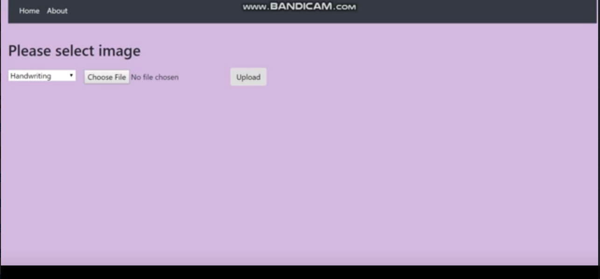

# Image-to-text-and-Face-Recognition

This website will allow users to do 2 functionality.

1 -> To upload images of block text and the server will return a string of text present in the image with help of Tesseract. 
2 -> To detect faces from picture uploaded to client side and displaying them. Done using openCV and Haarcascade.
On Client-side, page will upload images to the server, then output the results of the server’s analysis of the image. 

Functionality 1 could potentially be expanded by analysis of handwritten text or digit recognition.
Functionality 2 could potentially be expanded by capturing photos from the user’s webcam and saving it and then displaying it.

Note:
This is sample project referred from https://github.com/AlChiu/HandWriting-OCR-CNN-WebApp
